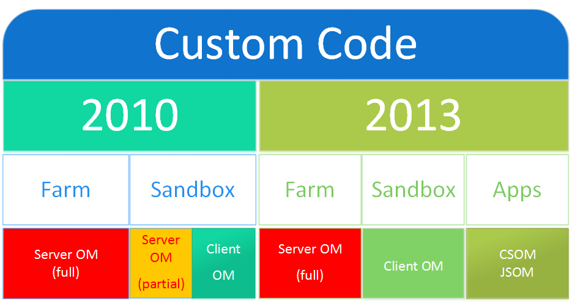

##Overview
- Understand requirements driving decisions.
- Establish options available to deliver solutions.
- Agree on best option(s).
- Assign ownership of and set a timetable for resulting actions.

##Logical architecture

##GSC Collaboration
- Project information management area
	- Create blue prints for creating project environments
	- Project creation & closure
	- Aggregate information - up to 200 projects per year
	- Standard documents, risks, issues, tasks, etc.
- Area for each project team to collaborate
	- Documents & list data
	- Permissions & security
	- Exchange documents with customer (OpCo) & supplier
- Customer area
	- Regions & OpCos
	- Exchange documents with project team
- Supplier area
	- Exchange documents with project team
- Project records area

##Project information management area
- Site collection
- Projects dashboard
	- Client side JavaScript
- **Full trust code**
	- Creating sites or generating scripts

##Custom code

##Project collaboration area
- Auto generated sites
	- List & libraries from project parts
	- Permissions
	- Standard documents & list items
- Exchange documents with customers & suppliers
- **Full trust code**
	- HTTP handler (project data WS)

##Custom code

##Customer (OpCo) collaboration area
- Region & OpCo structure
	- Security & permissions
- Possibly auto-generated
- Exchange documents with project teams

##Custom code

##Supplier collaboration area
- Possibly auto-generated
- Exchange documents with project teams
- Security & permissions

##Custom code

##Project records repository
- Records center site collection(s)